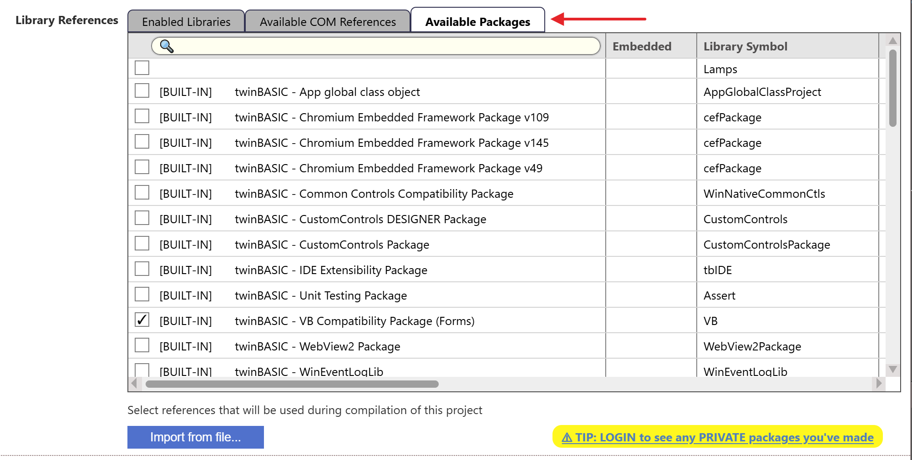

# Package Server

Code can be grouped as a package, and published to an online server. You can have Private packages, visible only to you, or Public packages, visible to everyone.

{:width="1002" height="506"}

For more information, see the following pages:

- [What is a package](../Packages/)
- [Creating a TWINPACK package](../Packages/Creating-TWINPACK)
- [Importing a package from a TWINPACK file](../Packages/Importing-TWINPACK)
- [Importing a package from TWINSERV](../Packages/Importing-TWINSERV)
- [Updating a package](../Packages/Updating)
