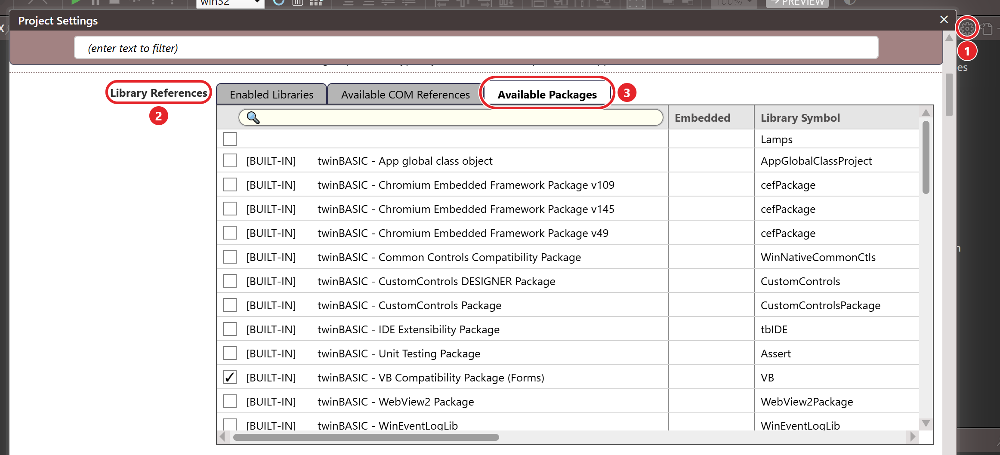
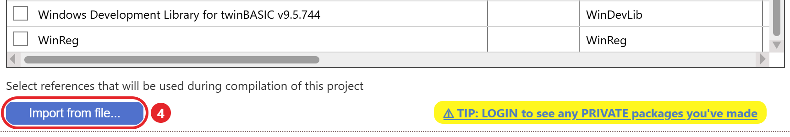
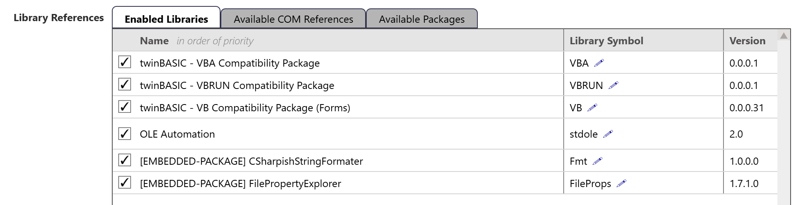
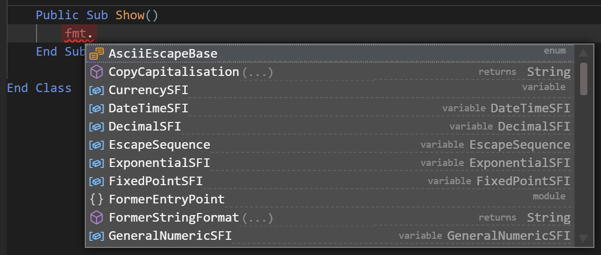

# Importing a package from a TWINPACK file

To import a package directly from a TWINPACK file (instead of using TWINSERV), follow these steps.

- open the project from which you want to use a package
- open the `Settings` file within it
- navigate to the **Library References** section
- select the **Available Packages** tab
{:width="1162" height="529"}
- press the **Import from file...** button:
{:width="862" height="150"}
- choose the TWINPACK file you want to import. The package is added to the **Available Packages** list, but BETA 1005 does not tick it: tick it yourself. It then appears, ticked, on the **Enabled Libraries** tab, marked `[EMBEDDED-PACKAGE]`:
{:width="995" height="257"}
- press **Apply Changes**

A project cannot import a package it already contains. If it holds an earlier build of the same package, the import is refused with `Failed to add package; '<name>' conflicts with an existing imported package.`, whatever the new build's Version. To replace the earlier build, see [Updating a package you built yourself](Updating#updating-a-package-you-built-yourself).

 

Now you're ready to use the package!  In the example shown above I added a reference to the CSharpishStringFormater package, and I can now confirm that I can access components from the package in my code:

{:width="592" height="252"}
 
 