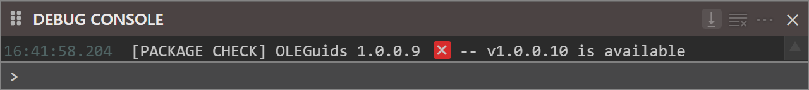
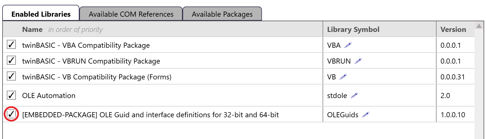

# Updating a package

How a project gets a newer build of a package depends on where the package came from: [TWINSERV](#updating-a-package-from-twinserv), or [a TWINPACK file](#updating-a-package-you-built-yourself).

## Updating a package from TWINSERV

The compiler will notify you if a newer version of a package in your project is available on TWINSERV when you load your project:

{:width="640" height="72"}

If you find an updated package is available on TWINSERV, you must first remove the old package from your project by deselecting it. Open Settings to References and, on the **Enabled Libraries** tab, untick the box. The IDE deletes the project's copy of the package, the folder `/Packages/<name>`, at once, without asking (see the warning under [Replacing an embedded copy](#replacing-an-embedded-copy)):

{:width="859" height="246"}

Then go to the Available Packages tab and check the box for the latest version and **after it's done** downloading, which may take a few seconds since some packages are a few MB, press **Apply Changes**. In the Debug Console you'll first see

`[PACKAGES] downloading package '{7E880520-9F56-45E1-9772-DF9FFE246715}/1/0/10/0' from the online database... `

then it's done and ready to be applied when a second message saying

`[PACKAGES] downloading package '{7E880520-9F56-45E1-9772-DF9FFE246715}/1/0/10/0' from the online database... [DONE]`

comes up. The checkbox also stops spinning and shows a tick, and the **Enabled Libraries** tab lists the package with `[EMBEDDED-PACKAGE]` before its name.

**Apply Changes** saves the project and restarts the compiler.

**NOTE:** In the future there will be a simple update option. Keep an eye out for that change.

## Updating a package you built yourself

This section covers any package imported from a TWINPACK file, whoever built it.

A project that references such a package normally *embeds* it: the project holds its own copy, in the `Packages` folder of its file system, at `/Packages/<name>`. An export writes that copy to `Packages\<name>\`. Building the package again does not change the copy in any project, so each project goes on running the build it has until that copy is replaced.

There are two ways to deliver a new build:

- [Replace the copy](#replacing-an-embedded-copy) in each project that embeds the package.
- [Link the package](#sharing-one-linked-copy), so that every project uses one shared file, and replace that file.

Neither way depends on the package's **Version**. The IDE does not compare versions for a package from a TWINPACK file, and accepts a lower version as well as a higher one.

### Replacing an embedded copy

The IDE refuses to import a package that the project already contains, whatever the new build's Version:

`Failed to add package; '<name>' conflicts with an existing imported package.`

So the old copy has to be removed first:

1. Open [Project Settings](../../tB/IDE/Project/Settings#library-references). Under **Library References**, on the **Enabled Libraries** tab, untick the package, and press **Apply Changes**. The IDE saves the project and restarts the compiler.
2. Open Project Settings again. On the **Available Packages** tab, press **Import from file...** and choose the new `.twinpack` file.
3. Tick the package in the **Available Packages** list. BETA 1005 adds the imported package to the list but does not tick it.
4. Press **Apply Changes** again. The project now uses the new build.

> [!WARNING]
> Unticking the package in step 1 deletes the project's copy of it, `/Packages/<name>`, at once. The IDE does not ask first. If you changed any of the package's files inside this project, copy them somewhere else before you untick it.

> [!IMPORTANT]
> Give step 1 its own **Apply Changes**. When the untick, the import and the tick share one **Apply Changes**, the compiler can go on running the old build until the project is saved and the compiler restarted. Restarting the compiler without saving brings the old copy back.

### Sharing one linked copy

A [linked package](Linked) is stored once, in `%APPDATA%\twinBASIC\packages`, and every project that links it loads it from there.

To link a package in a project that uses it, open Project Settings, go to the **Available Packages** tab, and untick **Embedded** on the package's row. Press **Apply Changes**, then save the project with **File → Save Project** (<kbd>CTRL</kbd> + <kbd>S</kbd>). **Apply Changes** does not save this change.

- In the first project, the IDE writes the package to `%APPDATA%\twinBASIC\packages` as a `.twinpack` file named after the package, and removes the project's own copy.
- In each further project the file already exists, so the IDE asks what to do. **Local Version** is the version of the shared file, and **Embedded Version** the version of this project's own copy. Choose **Use Existing Local Package**. **Overwrite Local Package (export it from this project)** replaces the shared file with this project's copy, for every project that links it.

To deliver a new build after that, replace the file in `%APPDATA%\twinBASIC\packages` with the new `.twinpack` file.

> [!IMPORTANT]
> The compiler reads a linked package only when it starts: when the project is opened, or when **Restart the compiler** is pressed on the [toolbar](../../tB/IDE/Project/Toolbar). A build does not read the file again. So after switching a project to the shared file, save the project and restart the compiler. After replacing the file, restart the compiler in each project that is open.

- The file is found by the package's project ID, not by its file name.
- A project that still embeds the package is not affected by the shared file.
- If the file is missing, the project cannot load the package, and each use of the package's names fails with error TB5079. See [Opening a project with missing linked package](Linked#opening-a-project-with-missing-linked-package).

### Checking which build a project uses

- After **Apply Changes**, the [DEBUG CONSOLE](../../tB/IDE/Project/DebugConsole) shows whether the compiler restarted. `[COMPILER] Project settings changes require compiler-restart` means the IDE saved the project and restarted the compiler. `[COMPILER] Project settings updated` means the compiler kept running, with the build it already had.
- The **Version** column on the **Enabled Libraries** tab shows the version recorded when the package was imported or linked. It cannot tell apart two builds with the same Version, and for a linked package it does not change when the file is replaced.