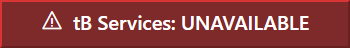
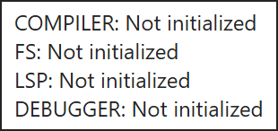
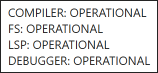
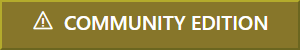

# Status Bar

{:width="661" height="27"}

With no project open, no compiler is connected: the services badge reads **UNAVAILABLE** and the licence badge reads **tB Licence: NOT READY**. Both change once a project has loaded and the compiler has answered.

The Status Bar runs along the bottom of the IDE window. It has four regions, left to right: the health of the backend services, the active licence tier, links to community resources, and the name of the command currently under the mouse cursor.

## Services

{:width="175" height="24"}

{:width="155" height="73"}

{:width="175" height="25"}

{:width="175" height="24"}

{:width="158" height="73"}

The badge's tooltip has one line for each of the four connections between the IDE and the compiler: **COMPILER**, **FS** (the project's files), **LSP** (the editor's language features, over the [Language Server Protocol](https://microsoft.github.io/language-server-protocol/)) and **DEBUGGER**. Each line gives that connection's state:

- **Not initialized** --- the connection has not been made, as with no project open;
- **Connecting** or **Disconnecting** --- the connection is being opened or closed;
- **OPERATIONAL** --- the connection is open;
- **Disconnected** --- the connection has closed;
- **Error occured** --- the connection failed. The IDE spells it this way.

The badge reads **LIMITED** while some of the four are connected and some are not, as it does for a moment while a compiler starts.

## Licence

- [Pre Order](https://twinbasic.com/preorder.html)

{:width="150" height="25"}

- Community Edition
- Professional Edition
- Ultimate Edition

## Links

{:width="127" height="27"}

- https://ko-fi.com/twinbasic
- https://discord.com/invite/UaW9GgKKuE
- http://x.com/waynephillipsea
- https://github.com/twinbasic/twinbasic

## Status

The rightmost region names the command a click would trigger --- the command under the mouse cursor. It gives the IDE's internal command identifier rather than the menu caption, so pointing at **Close Project** on the File menu shows **tbProject_Close**, as in the screenshot at the top of this page.

The name stays on screen after that command has run. It is replaced only when the pointer moves over another control that has a command of its own, and the region is blanked when the pointer moves into an area with no such control.

These are the same identifiers the keyboard shortcut map is keyed by --- see [Window](Menu/Window) for the full list and the keys bound to each one.
