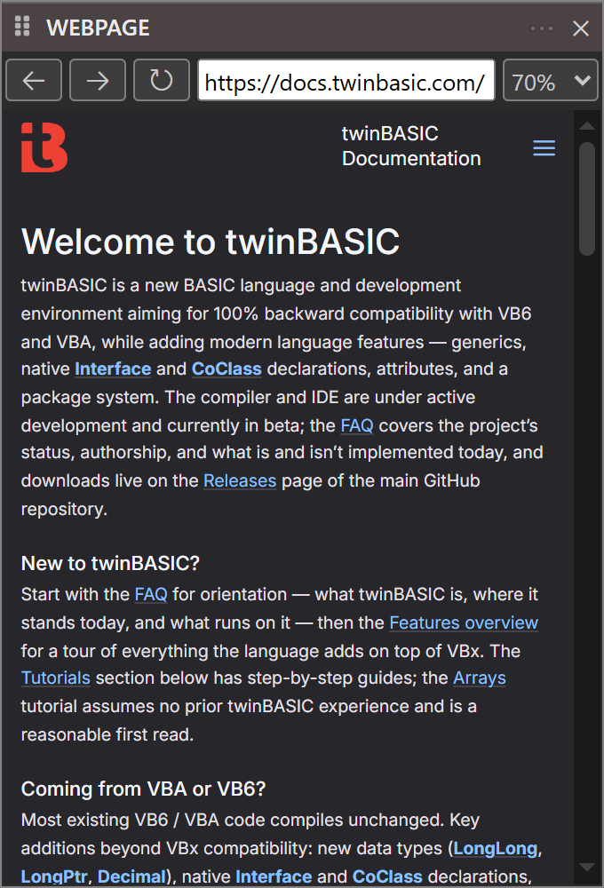

# Webpage

{:width="340" height="500"}

The Webpage pane embeds a web browser view inside the IDE, so online content can be read without opening an external browser.

Back, forward and reload buttons sit to the left of an address bar that accepts any URL, and a zoom dropdown at the right scales the rendered page --- 70 per cent, the default, in the screenshot above. The page itself fills the rest of the pane.
